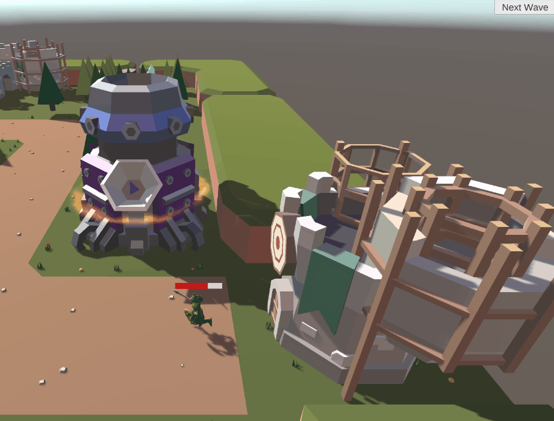

# Tower_Defense_mini

## 介绍：

***

这是一款塔防放置类游戏，玩家可以通过花费一定数量金币来建造不同塔（1.单体攻击塔；2.范围攻击塔；3.减速塔），通过击杀怪物和拆除塔来获得金币。按键wasdqe可以移动相机。

[开始游戏](Build/Tower_Defense_mini.exe)

## 整体代码逻辑设计

***

### **1.场景管理**

***

对游戏过程中的对象和进度控制进行管理，均使用单例模式

#### **1.1.波管理器**[WaveManager.cs](Assets/Scripts/WaveManager.cs)

1.事先定义了每一波怪物的数量、种类、血量

2.提供生成一波怪物的接口

#### **1.2.塔管理器**[TowerManager.cs](Assets/Scripts/TowerManager.cs)

1.时间记录所有可以建造的塔

2.记录场上所有的塔

3.提供建造塔的接口

#### **1.3.怪物管理器**[MonsterManager.cs](Assets/Scripts/MonsterManager.cs)

1.记录场上所有的怪物

2.提供生成一个怪物的接口

#### **1.4.输入管理器**[InputManager.cs](Assets/Scripts/InputManager.cs)

1.利用有限状态机处理输入

2.实现点击按钮后拖动塔

3.提供销毁一个塔的接口

#### **1.5.游戏管理器**[GameManager.cs](Assets/Scripts/GameManager.cs)

1.控制游戏的进度

2.实现各种开始游戏、暂停、结束、重新开始等辅助功能

### **2.场景对象**

***

#### **2.1.塔**[Tower.cs](Assets/Scripts/Tower.cs)

不同类型塔的基类，定义了一个塔的基本属性和方法（范围内的怪物、攻击距离、攻击范围、射速、初始化、开火、价格等）

##### **2.1.1单体攻击塔**[BallistaTower.cs](Assets/Scripts/BallistaTower.cs)

重写了开火函数 *Fire()*，每隔一段时间选取一个怪物进行攻击

##### **2.1.2范围攻击塔**[CanonTower.cs](Assets/Scripts/CanonTower.cs)

重写了开火函数 *Fire()*，每隔一段时间对范围内的怪物进行攻击

##### **2.1.3减速塔**[WatchTower.cs](Assets/Scripts/WatchTower.cs)

重写了开火函数 *Fire()*，每隔一段时间对范围内的怪物进行减速

#### **2.2.怪物**[Monster.cs](Assets/Scripts/Monster.cs)

使用NavMeshAgent进行导航

1.定义了怪物的血量、导航目标等属性

2.定义死亡、血条更新等方法

#### **2.2.子弹**[Bullet.cs](Assets/Scripts/Bullet.cs)

实时向目标怪物移动

#### **2.3.可建造区域**[Platform.cs](Assets/Scripts/Platform.cs)

记录该区域的塔